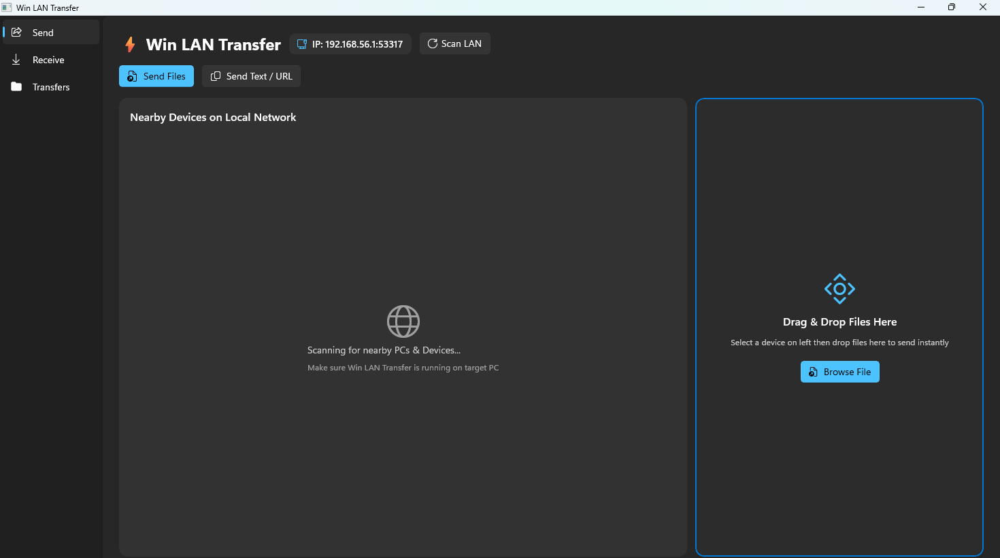

# ⚡ Win LAN Transfer

> Fast, private file & text sharing for Windows PCs and phones over your local Wi-Fi network. No cloud, no account, no USB cable.

[](https://dotnet.microsoft.com/)
[](https://learn.microsoft.com/windows/apps/winui/)
[](https://www.microsoft.com/windows)
[](LICENSE)
[](https://github.com/uponatime2019/WinLANTransfer/releases/latest)

## 📥 Try It Now / Download

**Get the latest portable build (zero-install):**

👉 **[Download WinLANTransfer (latest release)](https://github.com/uponatime2019/WinLANTransfer/releases/latest)**

1. Download the `WinLANTransfer-vX.Y.Z-win-x64.zip` asset.
2. Unzip anywhere.
3. Run `WinLANTransfer.exe` — no install, no admin rights needed.

> Requires Windows 10 1809+ / Windows 11, x64. Both PCs/phones must be on the same LAN/Wi-Fi.

## 📸 Screenshot



## ✨ Features

- 🔍 **Automatic LAN discovery** — finds nearby PCs via UDP broadcast, no manual IP entry.
- 📁 **File transfer PC ↔ PC** — pick a device, send files, drag & drop supported.
- 💬 **Text / URL sharing** — send clipboard text or links to a peer instantly.
- 📱 **Mobile web portal** — phones/tablets open `http://<pc-ip>:53317/` in any browser to upload files or send text. No app install on mobile.
- 📊 **Transfer history** — persistent local history (`%LocalAppData%\WinLANTransfer\history.json`), click an entry to reveal the file.
- 📂 **One-click downloads folder** — received files land in `Downloads\WinLANTransfer`.
- 🔒 **Fully local & private** — traffic never leaves your LAN. No cloud, no account, no telemetry.

## 🏗️ Architecture

```
┌──────────────┐  UDP :53317 broadcast   ┌──────────────┐
│ WinLANTransfer│ ── PING / discovery ──▶ │  Peer device │
│  (WinUI 3)   │ ◀── PING / discovery ── │              │
└──────┬───────┘                         └──────┬───────┘
       │ HTTP POST /api/send (file)            │
       │ HTTP POST /api/text (json)            │
       ▼                                       │
  TcpListener :53317                     HttpClient sender
  - parses raw HTTP                        - SendFileAsync
  - writes incoming files                  - SendTextAsync
  - raises OnTransferReceived
```

- **UI:** WinUI 3 `MainWindow` with Send / Receive / Transfers tabs (`MainWindow.xaml[.cs]`).
- **Discovery:** `Services/NetworkDiscoveryService.cs` (UDP broadcast + listen + expiry cleanup).
- **Server:** `Services/HttpTransferServer.cs` (raw `TcpListener` HTTP server, `/api/send`, `/api/text`, browser portal HTML).
- **Sender:** `Services/FileSenderService.cs` (`HttpClient` POST file bytes / JSON text).
- **Model:** `Services/NetworkDevice.cs`, `Services/TransferItem.cs` (INotifyPropertyChanged for progress).
- **Persistence:** `Services/TransferHistoryService.cs` (JSON in LocalAppData).

## 🧰 Technology Stack

| Layer | Tech |
|---|---|
| UI framework | WinUI 3 (Windows App SDK 2.4) |
| Language / runtime | C# 12 / .NET 8 (`net8.0-windows10.0.19041.0`) |
| Networking | `System.Net.Sockets` UDP + TCP, `HttpClient` |
| Serialization | Newtonsoft.Json |
| Packaging | Pure unpackaged, self-contained (`WindowsPackageType=None`, `WindowsAppSDKSelfContained=true`) |
| CI/CD | GitHub Actions → portable `.zip` Release on `v*` tags |

## ✅ Prerequisites

- Windows 10 version 1809 (build 17763)+ or Windows 11
- [.NET 8 SDK](https://dotnet.microsoft.com/download) (for building)
- Visual Studio 2022 17.8+ with **Windows App SDK** components (for UI development)

## 🚀 Build & Run

```bash
# Build
dotnet build "WinLANTransfer.csproj" -p:Platform=x64

# Run (unpackaged, Debug)
dotnet run --project "WinLANTransfer.csproj" -p:Platform=x64

# Portable Release publish (self-contained)
dotnet publish "WinLANTransfer.csproj" -c Release -p:Platform=x64 -o publish_out
# -> launch publish_out/WinLANTransfer.exe (confirm resources.pri sits next to it)
```

Or open `WinLANTransfer.sln` in Visual Studio and press **F5**.

## ⌨️ Keyboard Controls & Shortcuts

| Action | How |
|---|---|
| Switch tabs | Click **Send / Receive / Transfers** in the left nav |
| Scan for devices | **Scan LAN** button (also auto-scans every ~4 s) |
| Select target device | Click a device in the **Nearby Devices** list |
| Send files (picker) | **Send Files** / **Browse File** button |
| Send files (drag & drop) | Drop files onto the **Drag & Drop Files Here** zone |
| Send text / URL | **Send Text / URL** button → type → **Send** |
| Copy mobile portal link | **Copy Web Link** on the Receive tab |
| Open downloads folder | **Open Folder** on the Receive tab |
| Reveal a past transfer | Click the item in the **Transfers** list |

## 🗺️ Roadmap

- [ ] QR code for the mobile web portal URL (scan-to-open on phones)
- [ ] Multi-file picker + folder send (zip on the fly)
- [ ] Pause / resume / cancel for large transfers
- [ ] Transfer speed + ETA display in the Transfers list
- [ ] Dark / light theme toggle + accent color picker
- [ ] System tray minimize + background receive mode
- [ ] Receive accept/decline prompt for incoming files
- [ ] mDNS (`.local`) names alongside raw IPs
- [ ] Optional TLS + pairing PIN for untrusted LANs

## 🤝 Contributing & Community Welcome

We'd love your help! Whether it's your first open-source PR or your hundredth — **you are welcome here**. 💙

- 🍴 Fork the repo and submit a pull request
- 🐞 Report bugs or suggest features via [Issues](https://github.com/uponatime2019/WinLANTransfer/issues)
- 💬 Share ideas in [Discussions](https://github.com/uponatime2019/WinLANTransfer/discussions)

See [CONTRIBUTING.md](CONTRIBUTING.md) for build steps and PR guidelines. Please be kind and constructive — happy hacking!

## 📄 License

MIT — see [LICENSE](LICENSE).
